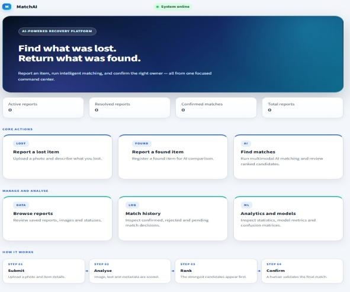
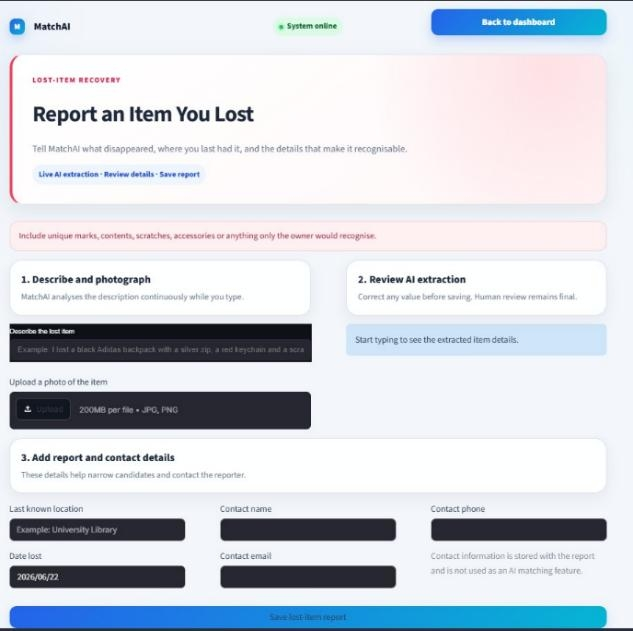
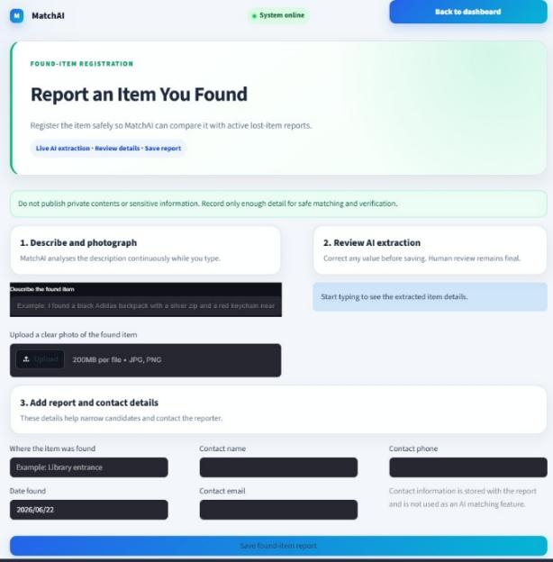
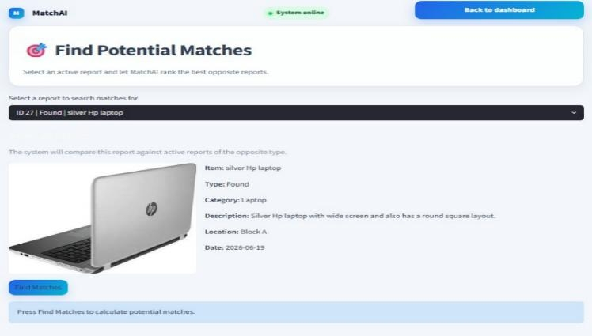

# MatchAI — Intelligent Lost-and-Found Matching System

MatchAI is an intelligent lost-and-found matching application designed to identify potential matches between lost-item and found-item reports.

The system combines computer vision, natural language processing, fuzzy attribute matching, and machine learning to generate and rank potential matches instead of relying on a single similarity method.

## Overview

Traditional lost-and-found systems often rely on users manually searching through reports or matching items using simple keywords.

MatchAI approaches the problem as a multi-modal matching task by combining information from:

- Item images
- Text descriptions
- Categories
- Colours
- Brands
- Locations
- Dates

The system processes these attributes independently and combines their results to produce ranked match recommendations.

## Key Features

### Lost and Found Reporting

- Submit lost-item reports
- Submit found-item reports
- Store item descriptions and attributes
- Upload item images
- Validate report information

### Computer Vision

- CNN-based image feature extraction
- Image feature representation
- KNN-based visual similarity matching
- Comparison of item images using extracted feature vectors

### Natural Language Processing

- TF-IDF text processing
- Text similarity analysis
- Naive Bayes text classification
- Processing of item descriptions

### Attribute Matching

Fuzzy matching techniques are used to compare attributes that may not be written exactly the same way.

Supported attributes include:

- Category
- Colour
- Brand
- Location
- Date

### Machine Learning

MatchAI combines multiple matching signals and uses a trained Random Forest classifier to assist with final match prediction.

### Ranked Match Recommendations

Potential matches are ranked according to their combined matching evidence, allowing users to focus on the most relevant candidates.

### Application Interface

The Streamlit application provides functionality for:

- Lost-item reporting
- Found-item reporting
- Match searching
- Match results
- Reports
- Dashboard and administrative functionality

## Matching Pipeline

MatchAI evaluates potential matches using multiple sources of evidence.

    Lost / Found Report
            |
    +-------+-------+-------+
    |               |       |
    Image           Text    Attributes
    |               |       |
    v               v       v
    CNN Features    TF-IDF  Fuzzy Matching
    |               |       |
    v               v       |
    KNN Similarity  Text    |
                    Similarity
    |               |       |
    +---------------+-------+
            |
            v
    Combined Matching Features
            |
            v
    Random Forest Model
            |
            v
    Match Prediction
            |
            v
    Ranked Candidates

## Matching Approach

The system combines several sources of evidence when evaluating potential matches.

| Matching Component | Weight |
|---|---:|
| Image similarity | 30% |
| Text similarity | 20% |
| Category | 15% |
| Colour | 10% |
| Brand | 10% |
| Location | 7.5% |
| Date | 7.5% |

These matching signals are combined to rank candidate reports and support the final matching process.

## Machine Learning Components

### CNN Image Feature Extraction

Images are processed to obtain numerical feature representations that capture visual information about the reported item.

These feature vectors can then be compared with other item images.

### KNN Visual Similarity

K-Nearest Neighbors is used to identify visually similar item representations based on their extracted feature vectors.

### TF-IDF Text Processing

Item descriptions are transformed into numerical representations using Term Frequency-Inverse Document Frequency (TF-IDF).

This allows the system to compare descriptions based on their textual content.

### Naive Bayes Text Classification

A Naive Bayes classifier is used as part of the text-processing pipeline to classify item descriptions.

### Fuzzy Attribute Matching

Fuzzy matching allows the system to handle small differences in how attributes are entered.

For example:

- Black
- black colour
- Black-colored

can be treated as related rather than requiring exact string equality.

### Random Forest Match Prediction

A trained Random Forest classifier combines matching features to assist with the final prediction used in the matching process.

## Technology Stack

### Programming Language

- Python 3.11

### Application Framework

- Streamlit

### Machine Learning

- Scikit-learn
- TensorFlow

### Computer Vision

- OpenCV
- Pillow

### Data Processing

- NumPy
- Pandas

### Machine Learning Techniques

- CNN feature extraction
- KNN
- Naive Bayes
- Random Forest
- TF-IDF
- Fuzzy matching

### Storage

- SQLite

### Model Serialization

- Joblib

### Visualization

- Matplotlib

## Project Structure

    MATCHAI/
    |
    +-- ai_models/
    |   +-- build_feature_database.py
    |   +-- cnn_features.py
    |   +-- final_matcher.py
    |   +-- fuzzy_rules.py
    |   +-- generate_match_pairs.py
    |   +-- knn_matcher.py
    |   +-- text_classifier.py
    |   +-- text_similarity.py
    |   +-- train_final_matcher.py
    |   +-- train_text_classifier.py
    |
    +-- data/
    |   +-- image_features/
    |   +-- match_pairs/
    |   +-- raw_images/
    |   +-- text_data/
    |
    +-- database/
    |   +-- __init__.py
    |   +-- database_manager.py
    |   +-- image_manager.py
    |
    +-- models/
    |   +-- final_match_classifier.joblib
    |   +-- final_match_metadata.joblib
    |   +-- text_classifier.joblib
    |
    +-- outputs/
    |   +-- charts/
    |   +-- test_results.txt
    |
    +-- services/
    |   +-- extraction_service.py
    |   +-- report_service.py
    |
    +-- tests/
    |
    +-- ui/
    |   +-- __init__.py
    |   +-- components.py
    |   +-- pages.py
    |   +-- styles.py
    |
    +-- app.py
    +-- config.py
    +-- requirements.txt
    +-- Procfile
    +-- .railwayignore
    +-- .gitignore
    +-- README.md

## Installation

### 1. Clone the Repository

    git clone https://github.com/FANIZO/MATCHAI.git
    cd MATCHAI

### 2. Create a Virtual Environment

On Windows:

    python -m venv .venv

### 3. Activate the Virtual Environment

    .\.venv\Scripts\Activate.ps1

### 4. Install Dependencies

    python -m pip install --upgrade pip
    pip install -r requirements.txt

## Running the Application

Start the Streamlit application with:

    streamlit run app.py

The application should then open in your browser.

## Testing

MatchAI includes a dedicated automated test suite covering multiple components of the system.

Run the tests with:

    pytest

The test suite covers areas including:

- Database operations
- Image processing
- CNN feature extraction
- Image similarity
- Fuzzy matching
- Match decisions
- Matching pipeline
- Model files
- Input validation
- Performance
- Saved feature data

## Screenshots

### Main Interface

The main MatchAI interface provides access to the lost-and-found reporting and matching workflow.

### Lost Item Report

Users can submit reports for lost items, including descriptions and relevant item attributes.

### Found Item Report

Users can submit reports for found items, providing information that can be used by the matching system to identify potential matches.

### Match Results

MatchAI generates and ranks potential matches based on visual similarity, textual similarity, and item attributes.

## Design Goals

MatchAI was designed around several goals:

1. Combine multiple sources of information instead of relying on a single matching technique.
2. Use image and text information together.
3. Handle variations in attribute descriptions.
4. Rank potential matches instead of returning only one result.
5. Separate application, machine-learning, database, service, and interface components.
6. Provide a testable and maintainable project structure.

## Limitations

The system is a project implementation and should not be considered a production-grade lost-and-found platform.

Potential limitations include:

- Matching performance depends on the quality of submitted images and descriptions.
- Model performance depends on the available training data.
- Similar-looking objects may produce false-positive matches.
- Poor-quality or incomplete descriptions can reduce text-matching accuracy.
- Fuzzy matching may produce unexpected similarities for ambiguous attributes.
- The current implementation is primarily intended as an academic and portfolio project.

## Future Improvements

Potential improvements include:

- Larger and more diverse training datasets
- Improved image embedding models
- More advanced semantic text embeddings
- Deep-learning-based multimodal matching
- Improved ranking algorithms
- User authentication and authorization
- Cloud database integration
- Image preprocessing and quality enhancement
- Real-time notifications for potential matches
- Production deployment
- Improved model evaluation and performance monitoring

## Learning Outcomes

This project provided practical experience in:

- Machine learning
- Computer vision
- Natural language processing
- Feature engineering
- Similarity search
- Fuzzy matching
- Classification
- Data processing
- Model training
- Python application development
- Streamlit development
- SQLite database management
- Automated testing
- Software architecture

## Project Purpose

MatchAI was developed as a practical project to explore how multiple artificial intelligence and machine-learning techniques can be combined to solve a real-world matching problem.

Rather than relying on a single algorithm, the project demonstrates a multi-stage matching pipeline that combines visual, textual, and structured attribute information.

## Author

Irfan Mohamed Abdulrahman

Cybersecurity Student | Python | Machine Learning | Cybersecurity

GitHub: https://github.com/FANIZO

## License

This project is intended for educational and portfolio purposes.